## Ecuaciones de navier-stokes en 2D
ecuaciones de navier-stokes en 2D para un fluido incompresible

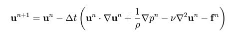

### Formula 1

- u : vector de velocidad del fluido en las direcciones x e y.
- ∇⋅u : divergencia de u .

### Formula 2

∂u/∂t: cambio temporal de la velocidad.

(u⋅∇u)u: termino convectivo que describe la aceleración de las partículas de fluido.

(1/𝜌)∇p: gradiente de presión, actua como una fuerza que impulsa el fluido desde las zonas de alta presión hacia zonas de baja presión.

ν∇²u: termino viscoso,ν es la viscosidad cinematica, ∇² es el operador laplaciano, que describe la difusión de la velocidad debido a la viscosidad.

f: fuerza externa.

𝜌: es la densidad del fluido.(constante en un fluido incompresible)

---

### Gradiente

### Divergencia
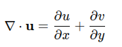

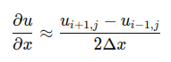
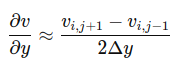

### Laplaciano

---

### Derivada temporal
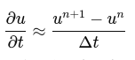

### Advección
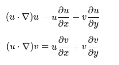

- adveccion de u:

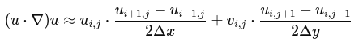

- adveccion de v:

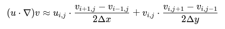

### Gradiente de presión

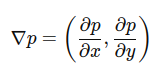

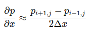
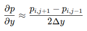

### Difusión

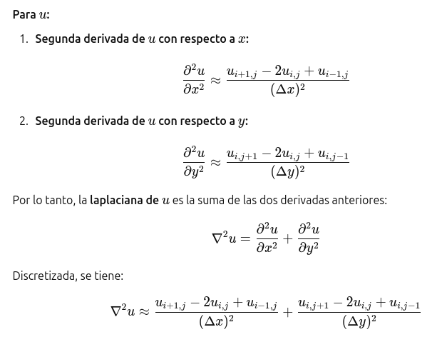

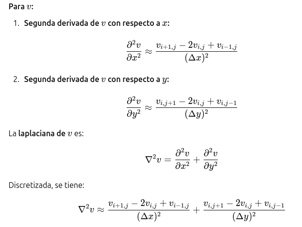
